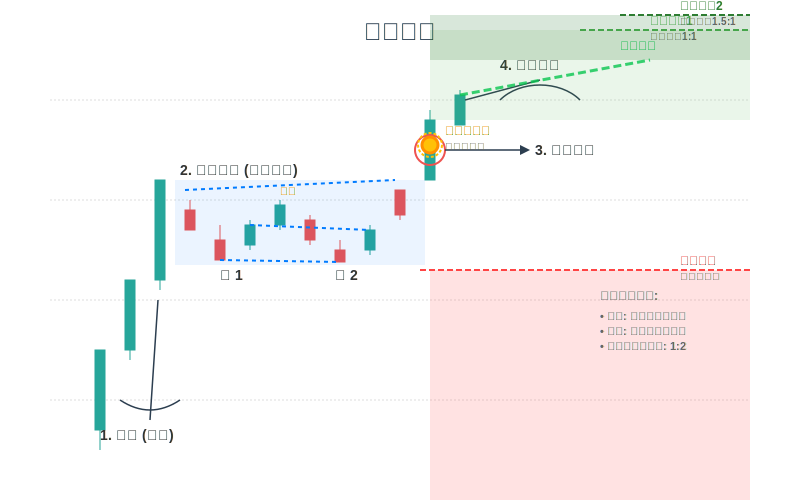

# 趋势回调波段交易系统

这是一个基于技术分析的趋势回调波段交易系统，专注于识别和交易各种市场形态。

## 系统概述

本交易系统基于以下核心组件：

1. **趋势分析**：使用EMA均线组判断市场趋势方向和强度
2. **形态识别**：识别各种交易形态，包括双底牛旗、双顶熊旗、两段式整理、三推楔形和回调形态末期的窄幅交易区间
3. **入场信号**：检测强单K线反转、强双K线反转、二次突破和通道线挂单等入场信号
4. **支撑阻力分析**：识别关键价格水平，包括水平位、斐波那契回调位和动态均线支撑位
5. **订单管理**：设置止盈止损和手动出场条件

## 交易形态说明

系统可以识别以下交易形态：

### 1. 双底牛旗 (Bull Flag)

牛旗形态特征:
- 前期有明显的上涨趋势（旗杆）
- 随后出现小幅回调整理（旗面），通常呈下降通道或三角形
- 整理期间成交量逐渐萎缩
- 价格突破旗面上轨时成交量放大，确认突破

### 2. 双顶熊旗 (Bear Flag)

熊旗形态特征:
- 前期有明显的下跌趋势（旗杆）
- 随后出现小幅反弹整理（旗面），通常呈上升通道或三角形
- 整理期间成交量逐渐萎缩
- 价格跌破旗面下轨时成交量放大，确认突破

### 3. 两段式整理 (Two-Stage Consolidation)

两段式整理形态特征:
- 价格经历两个明显的横盘整理阶段
- 两个整理阶段之间有一个小幅波动的过渡期
- 第二段整理的波动范围通常小于第一段
- 成交量在整个形态中逐渐萎缩
- 突破方向通常延续之前的主趋势

### 4. 三推楔形 (Wedge)

三推楔形形态特征:
- 价格形成三个连续的波动（三推）
- 波动形成收敛的楔形通道
- 上升楔形：上轨和下轨都向上倾斜，但上轨斜率较小
- 下降楔形：上轨和下轨都向下倾斜，但下轨斜率较小
- 成交量通常在形态发展过程中逐渐萎缩
- 突破方向通常与楔形方向相反

### 5. 回调形态末期的窄幅交易区间 (Narrow Range After Retracement)

窄幅交易区间特征:
- 价格在回调后进入窄幅震荡
- 价格波动范围逐渐缩小
- 成交量明显萎缩
- 通常出现在回调末期，预示着行情即将恢复原趋势
- 突破方向通常与主趋势一致

## 使用方法

### 安装依赖

```bash
pip install -r requirements.txt
```

### 运行示例

```bash
python examples/pattern_detection_example.py
```

### 形态识别API

以下是各种形态识别函数的使用方法：

```python
from app.analysis.pattern.bull_flag import detect_bull_flag
from app.analysis.pattern.bear_flag import detect_bear_flag
from app.analysis.pattern.consolidation import detect_two_stage_consolidation
from app.analysis.pattern.wedge import detect_wedge
from app.analysis.pattern.narrow_range import detect_narrow_range_after_retracement

# 加载OHLCV数据
df = pd.DataFrame(...)  # 包含'open', 'high', 'low', 'close', 'volume'列的DataFrame

# 检测牛旗形态
bull_flags = detect_bull_flag(df, min_pole_height_pct=0.08, max_flag_bars=24, min_flag_bars=6)

# 检测熊旗形态
bear_flags = detect_bear_flag(df, min_pole_height_pct=0.08, max_flag_bars=24, min_flag_bars=6)

# 检测两段式整理形态
consolidations = detect_two_stage_consolidation(df, min_length=15, max_length=60)

# 检测三推楔形形态
wedges = detect_wedge(df, min_length=15, max_length=50, min_swings=3)

# 检测回调形态末期的窄幅交易区间
narrow_ranges = detect_narrow_range_after_retracement(df, lookback_period=50, narrow_range_bars=10)
```

## 参数说明

各形态识别函数的主要参数说明：

### 牛旗/熊旗形态

- `min_pole_height_pct`: 旗杆最小高度（相对于价格的百分比）
- `max_flag_bars`: 旗面最大持续K线数
- `min_flag_bars`: 旗面最小持续K线数
- `volume_threshold`: 成交量萎缩阈值（相对于旗杆期间平均成交量）

### 两段式整理

- `min_length`: 整个形态的最小长度（K线数量）
- `max_length`: 整个形态的最大长度（K线数量）
- `volatility_threshold`: 整理阶段的最大波动率（相对于价格的百分比）
- `transition_threshold`: 过渡期的最小波动率（相对于价格的百分比）

### 三推楔形

- `min_length`: 形态的最小长度（K线数量）
- `max_length`: 形态的最大长度（K线数量）
- `min_swings`: 最小波动次数（通常为3，即三推）
- `max_angle_diff`: 上下轨道角度最大差异（度）

### 窄幅交易区间

- `lookback_period`: 用于确定主趋势的回溯期K线数
- `min_retracement_pct`: 最小回调幅度（相对于价格的百分比）
- `narrow_range_bars`: 窄幅区间的最小K线数
- `volume_threshold`: 成交量萎缩阈值（相对于回调前的平均成交量）

## 技术分析形态图解

系统支持识别的各种技术分析形态的可视化图表示例，帮助理解每种形态的特征和交易含义：

### 1. 双底牛旗形态


**特征说明：**
- 强劲上涨旗杆后出现旗形整理
- 整理过程中形成双底支撑结构
- 双底形成后突破颈线阻力
- 向上突破旗形上轨确认继续上涨


### 2. 双顶熊旗形态


**特征说明：**
- 强劲下跌旗杆后出现反弹整理
- 反弹过程中形成双顶阻力结构
- 成交量在整理期间逐渐萎缩
- 向下突破旗形下轨确认继续下跌


### 3. 两段式整理形态


**特征说明：**
- 先经历宽幅横盘整理阶段
- 后进入窄幅收敛整理阶段
- 波动幅度逐渐收敛，成交量萎缩
- 突破方向通常延续主趋势


### 4. 三推楔形形态


**特征说明：**
- 三次推动力度递减形成收敛楔形
- 每次推动的力度逐渐减弱
- 成交量在形态发展中逐渐萎缩
- 通常预示着趋势反转信号


### 5. 回调末期窄幅交易区间


**特征说明：**
- 上升趋势中的回调末期特征
- 价格波动幅度逐渐缩小
- 成交量明显萎缩，能量蓄积
- 通常是趋势恢复的前兆信号


